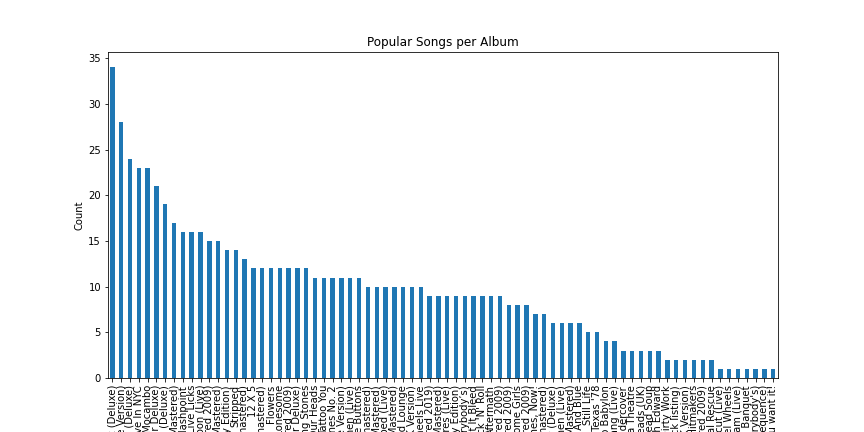
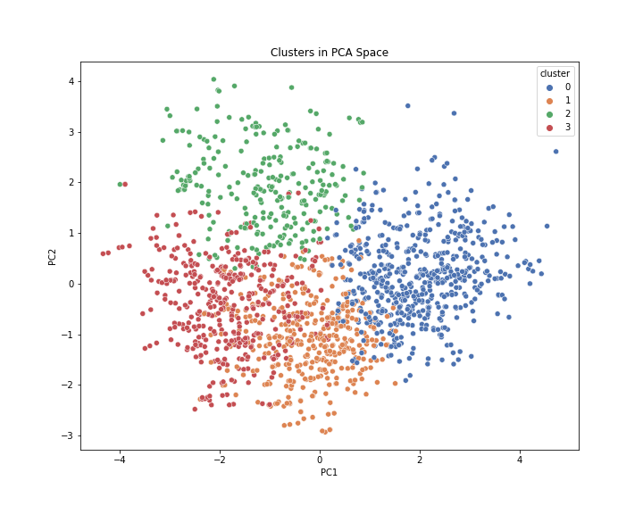

# Music_Analysis_Recommendation
This model analysis music for patterns, identifies patterns and trends, and can be used to power recommendation systems.

# Rolling_Stones_Spotify_Analysis
This project analyzes The Rolling Stones’ Spotify tracks to identify patterns and group songs into meaningful clusters, serving as a powerful tool for music analysts and playlist curators.

## Overview:
This project uses machine learning to analyze The Rolling Stones’ Spotify dataset, uncovering song characteristics and trends. Built with Python, it employs exploratory data analysis (EDA), Principal Component Analysis (PCA), and K-means clustering to group tracks and recommend albums. The pipeline cleans data, handles outliers, and visualizes insights, making it valuable for music industry professionals and fans.

## The Value this Provides to Music Industry and Analysts:
- *Song Categorization*: Clusters tracks (e.g., energetic, ballads) for playlist curation.
- *Album Recommendations*: Identifies top albums (e.g., [top_albums]) based on popularity.
- *Trend Insights*: Tracks feature evolution (e.g., 1970s energy, 2000s danceability).
- *Data-Driven Strategies*: Informs marketing or historical music studies.
Example: this project can help labels curate playlists from Cluster 1 (upbeat hits) or target fans with Cluster 2 (ballads) for tailored experiences.

## How This Demonstrates the ML Process:
This project showcases an unsupervised ML workflow:
- *Data Preprocessing*: Handles outliers, missing values, and feature scaling.
- *EDA*: Uncovers patterns via visualizations.
- *Unsupervised Learning*: K-means clusters songs (k=4).
- *Dimensionality Reduction*: PCA retains 95% variance.
- *Evaluation*: Uses silhouette scores and elbow method.
- *Practicality*: Translates clusters into music insights.
- *Reproducibility*: Customizable for other Spotify data.

### Features:
- *Data Quality Checks*: Removes duplicates and outliers, fills missing values.
- *Exploratory Data Analysis (EDA)*: Visualizes feature distributions, correlations, and decade trends.
- *Dimensionality Reduction*: Reduces features to 9 via PCA (95% variance).
- *Clustering*: Groups tracks into 4 clusters using K-means.
- *Evaluation*: Validates clusters with SSE and silhouette scores.
- *Output*: Saves visualizations and clustered data (*rolling_stones_clustered.csv*).

### Dataset Details: (rolling_stones_spotify.csv)
The *rolling_stones_spotify.csv* dataset includes [df.shape[0]] track records with features:
- *acousticness*: Acoustic presence (0-1).
- *danceability*: Dance suitability (0-1).
- *energy*: Intensity (0-1).
- *instrumentalness*: Lack of vocals (0-1).
- *liveness*: Live performance likelihood (0-1).
- *loudness*: Volume (-60 to 0 dB).
- *speechiness*: Spoken words (0-1).
- *tempo*: Beats per minute.
- *valence*: Musical positivity (0-1).
- *popularity*: Spotify popularity score (0-100).
- *duration_ms*: Track length in milliseconds.

### Exploratory Data Analysis:
- *Correlation Heatmap*: Shows correlations (e.g., [insert key correlation, e.g., energy vs. popularity]).
- *Distribution Plots*: Features like *tempo* are bimodal; *popularity* varies widely.
- *Decade Trends*: 1970s favor *energy*, 2000s lean toward *danceability* (console output).
- *Popular Albums*: Top albums (e.g., [top_albums]) have the most popular tracks.

### Preprocessing:
- Removes duplicates ([duplicates_count] removed) and irrelevant columns (*id*, *uri*).
- Caps outliers (z-scores > 3), clips features (e.g., *loudness* to [-60, 0]).
- Fills missing values with medians.
- Scales features for PCA and clustering.

### Dimensionality Reduction:
- PCA reduces 11 features to 9, retaining 95% variance (console output).
- Minimizes multicollinearity for clustering.

### Clustering:
K-means clustering (4 clusters) on PCA-transformed data:
- Cluster 0: High *energy* (0.925), *liveness* (0.835)—live/energetic tracks.
- Cluster 1: High *danceability* (0.525), *valence* (0.751)—upbeat hits.
- Cluster 2: High *acousticness* (0.511), low *tempo* (108.97)—ballads.
- Cluster 3: High *duration_ms* (184.8s), *instrumentalness* (0.176)—intros/outros (console output).

### Model Training and Evaluation:
- *Elbow Method*: SSE flattens at k=4.
- *Silhouette Score*: Peaks at k=2 (0.193), but k=4 chosen for detailed cohorts (console output).
- *Cluster Sizes*: [insert cluster_sizes, e.g., Cluster 0: 150]—reasonably balanced (console output).

### Prediction and Risk Zones:
Not applicable; clustering assigns tracks to groups for analysis, exported to *rolling_stones_clustered.csv*.

### My contact information:
- *Danny Barren*
- barren.danny@gmail.com
- https://www.linkedin.com/in/danny-barren/
- https://www.redballoon.work/public-profile/86c26e24e9332e6d74f0f3bb34abd38b?profile=5b46543239f9bcc1ce3e9cb2dbed2c0c

### License
MIT License -- See LICENSE
